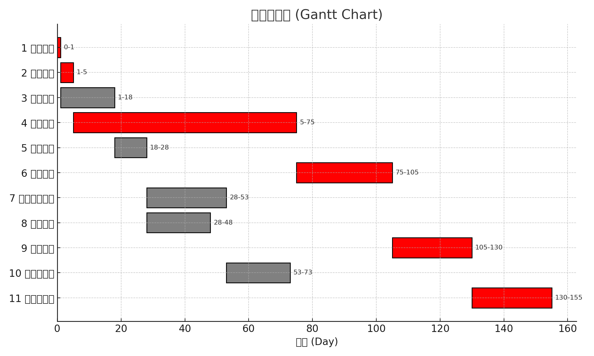
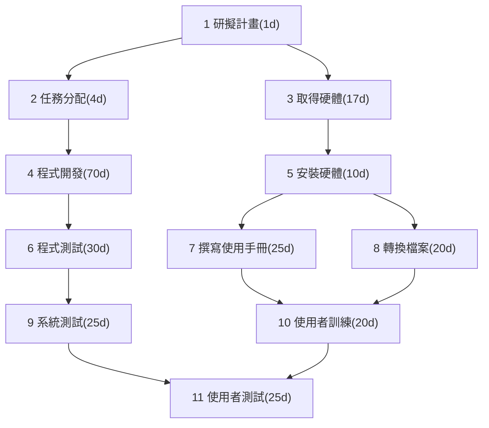

## 一、任務清單

| 任務編號 | 任務說明 | 需時（天） | 前置任務 |
|-----------|-----------|-------------|-----------|
| 1 | 研擬計畫 | 1 | - |
| 2 | 任務分配 | 4 | 1 |
| 3 | 取得硬體 | 17 | 1 |
| 4 | 程式開發 | 70 | 2 |
| 5 | 安裝硬體 | 10 | 3 |
| 6 | 程式測試 | 30 | 4 |
| 7 | 撰寫使用手冊 | 25 | 5 |
| 8 | 轉換檔案 | 20 | 5 |
| 9 | 系統測試 | 25 | 6 |
| 10 | 使用者訓練 | 20 | 7, 8 |
| 11 | 使用者測試 | 25 | 9, 10 |

---

## 二、前向與回向傳遞計算結果

| 任務 | 需時 | ES | EF | LS | LF | Slack |
|------|------|----|----|----|----|--------|
| 1 | 1 | 0 | 1 | 0 | 1 | 0 |
| 2 | 4 | 1 | 5 | 1 | 5 | 0 |
| 3 | 17 | 1 | 18 | 58 | 75 | 57 |
| 4 | 70 | 5 | 75 | 5 | 75 | 0 |
| 5 | 10 | 18 | 28 | 75 | 85 | 57 |
| 6 | 30 | 75 | 105 | 75 | 105 | 0 |
| 7 | 25 | 28 | 53 | 85 | 110 | 57 |
| 8 | 20 | 28 | 48 | 90 | 110 | 62 |
| 9 | 25 | 105 | 130 | 105 | 130 | 0 |
| 10 | 20 | 53 | 73 | 110 | 130 | 57 |
| 11 | 25 | 130 | 155 | 130 | 155 | 0 |

---

## 三、甘特圖圖片

---

## 四、PERT/CPM 圖結構

---

## 五、關鍵路徑 (Critical Path)

** 關鍵任務（Slack = 0）：**
1 → 2 → 4 → 6 → 9 → 11

 專案最短完工時間：155 天

